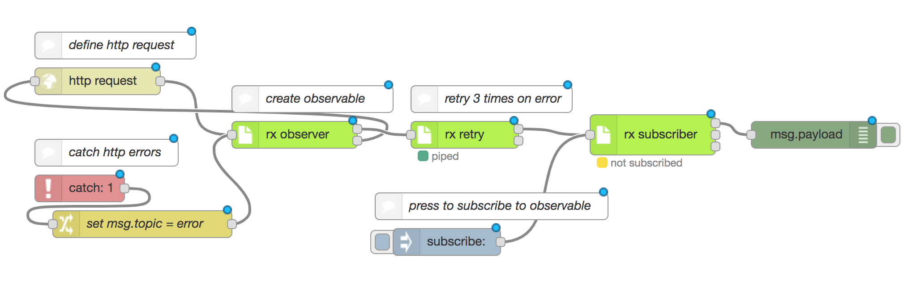
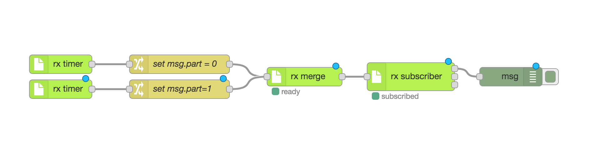

# node-red-contrib-rxjs

Implementation of rxjs in node red. 

**This node-red library is in an highly experimental state and it does not include all the operators yet. If people find this useful, I will continue developing it.**

## Examples

### Filter doubleclicks

This flow implements a double click detection. if the click trigger is send twice in between 300 ms, a message will be send.


#### Flow

```json
[{"id":"2a7738b4.a110b8","type":"debug","z":"a0b28744.cb2298","name":"","active":true,"tosidebar":true,"console":false,"tostatus":false,"complete":"false","x":850,"y":440,"wires":[]},{"id":"5b2ca394.0d1aec","type":"inject","z":"a0b28744.cb2298","name":"","topic":"","payload":"click","payloadType":"str","repeat":"","crontab":"","once":false,"onceDelay":0.1,"x":130,"y":380,"wires":[["31da16f5.5b832a"]]},{"id":"d502aec9.6bc65","type":"rx operator","z":"a0b28744.cb2298","name":"","bufferCount_bufferSize":1,"bufferCount_startEvery":"","catch_func":"return { topic : \"error\", payload: error }","distinct_key":"payload","mapTo_topic":"foo","mapTo_payload":"bar","mapTo_payloadType":"str","take_count":1,"filter_func":"return msg.payload > 0","scan_seed":0,"scan_seedType":"num","scan_func":"return acc + msg.payload","skip_count":1,"repeat_count":1,"retry_number":1,"timeout":1000,"delay":1000,"operatorType":"timeInterval","x":280,"y":480,"wires":[["7daea084.c6927"],[]]},{"id":"7daea084.c6927","type":"rx operator","z":"a0b28744.cb2298","name":"","bufferCount_bufferSize":1,"bufferCount_startEvery":"","catch_func":"return { topic : \"error\", payload: error }","distinct_key":"payload","mapTo_topic":"foo","mapTo_payload":"bar","mapTo_payloadType":"str","take_count":1,"filter_func":"return msg.interval < 300","scan_seed":0,"scan_seedType":"num","scan_func":"return acc + msg.payload","skip_count":1,"repeat_count":1,"retry_number":1,"timeout":1000,"delay":1000,"operatorType":"filter","x":470,"y":480,"wires":[["2ed7c0fc.d32e6"],[]]},{"id":"2d784b0c.7aa9c4","type":"rx subscriber","z":"a0b28744.cb2298","name":"","auto_subscribe":true,"bundle":false,"x":670,"y":440,"wires":[["2a7738b4.a110b8"],[],[]]},{"id":"2ed7c0fc.d32e6","type":"rx operator","z":"a0b28744.cb2298","name":"","bufferCount_bufferSize":1,"bufferCount_startEvery":"","catch_func":"return { topic : \"error\", payload: error }","distinct_key":"payload","mapTo_topic":"","mapTo_payload":"double-click","mapTo_payloadType":"str","take_count":1,"filter_func":"return msg.payload > 0","scan_seed":0,"scan_seedType":"num","scan_func":"return acc + msg.payload","skip_count":1,"repeat_count":1,"retry_number":1,"timeout":1000,"delay":1000,"operatorType":"mapTo","x":520,"y":380,"wires":[["2d784b0c.7aa9c4"],[]]},{"id":"31da16f5.5b832a","type":"rx observer","z":"a0b28744.cb2298","name":"","x":290,"y":380,"wires":[["d502aec9.6bc65"],[]]}]
```

### Retry http request on error

This Flow implements an http request, which is repeated up to three times if failed. When subscribed is clicked, it starts the first request.



#### Flow

```json
[{"id":"65a090e6.1476c","type":"rx observer","z":"a3ada78c.e8b5d8","name":"","x":350,"y":260,"wires":[["7034ff47.7d735"],["10525566.03493b"]]},{"id":"12e4978f.1c14a8","type":"rx subscriber","z":"a3ada78c.e8b5d8","name":"","auto_subscribe":false,"bundle":false,"x":750,"y":260,"wires":[["1093291d.70e2f7"],[],[]]},{"id":"1093291d.70e2f7","type":"debug","z":"a3ada78c.e8b5d8","name":"","active":true,"tosidebar":true,"console":false,"tostatus":false,"complete":"false","x":930,"y":260,"wires":[]},{"id":"10525566.03493b","type":"http request","z":"a3ada78c.e8b5d8","name":"","method":"GET","ret":"txt","paytoqs":false,"url":"http://unreachable.url:123","tls":"","proxy":"","authType":"","x":130,"y":200,"wires":[["65a090e6.1476c"]]},{"id":"82af8421.224f68","type":"catch","z":"a3ada78c.e8b5d8","name":"","scope":["10525566.03493b"],"uncaught":false,"x":110,"y":320,"wires":[["986b234.e1561e"]]},{"id":"986b234.e1561e","type":"change","z":"a3ada78c.e8b5d8","name":"set msg.topic = error","rules":[{"t":"set","p":"topic","pt":"msg","to":"error","tot":"str"}],"action":"","property":"","from":"","to":"","reg":false,"x":180,"y":360,"wires":[["65a090e6.1476c"]]},{"id":"7034ff47.7d735","type":"rx operator","z":"a3ada78c.e8b5d8","name":"","bufferCount_bufferSize":1,"bufferCount_startEvery":"","catch_func":"return { topic : \"error\", payload: error }","distinct_key":"payload","mapTo_topic":"foo","mapTo_payload":"bar","mapTo_payloadType":"str","take_count":1,"filter_func":"return msg.payload > 0","scan_seed":0,"scan_seedType":"num","scan_func":"return acc + msg.payload","skip_count":1,"repeat_count":"3","retry_number":"3","timeout":1000,"delay":1000,"operatorType":"retry","x":540,"y":260,"wires":[["12e4978f.1c14a8"],[]]},{"id":"13b394a1.464c1b","type":"inject","z":"a3ada78c.e8b5d8","name":"","topic":"subscribe","payload":"","payloadType":"str","repeat":"","crontab":"","once":false,"onceDelay":0.1,"x":520,"y":380,"wires":[["12e4978f.1c14a8"]]},{"id":"1b9785be.6e12ba","type":"comment","z":"a3ada78c.e8b5d8","name":"press to subscribe to observable","info":"","x":570,"y":340,"wires":[]},{"id":"46ac64d8.11e48c","type":"comment","z":"a3ada78c.e8b5d8","name":"retry 3 times on error","info":"","x":570,"y":220,"wires":[]},{"id":"73df1bf.136a1e4","type":"comment","z":"a3ada78c.e8b5d8","name":"create observable","info":"","x":370,"y":220,"wires":[]},{"id":"9cfb1905.cf9ce8","type":"comment","z":"a3ada78c.e8b5d8","name":"catch http errors","info":"","x":140,"y":280,"wires":[]}]
```

### Combine Usage

This Flow merges to timer observables.



```json
[{"id":"bbd8775a.3d1968","type":"rx subscriber","z":"6a7871a.4f90a9","name":"","auto_subscribe":true,"bundle":true,"x":730,"y":300,"wires":[["2aca65be.dc0f8a"],[],[]]},{"id":"e66470b6.51585","type":"rx timer","z":"6a7871a.4f90a9","name":"","initialDelay":1000,"period":"1000","x":170,"y":280,"wires":[["2dcac9c.9860536"]]},{"id":"9012039b.cc432","type":"rx timer","z":"6a7871a.4f90a9","name":"","initialDelay":1000,"period":"2000","x":170,"y":320,"wires":[["81893153.be4fc"]]},{"id":"65db7027.f494b","type":"rx combine","z":"6a7871a.4f90a9","name":"","numberOfInputs":2,"operatorType":"merge","x":560,"y":300,"wires":[["bbd8775a.3d1968"]]},{"id":"2aca65be.dc0f8a","type":"debug","z":"6a7871a.4f90a9","name":"","active":true,"tosidebar":true,"console":false,"tostatus":false,"complete":"true","targetType":"full","x":890,"y":300,"wires":[]},{"id":"2dcac9c.9860536","type":"change","z":"6a7871a.4f90a9","name":"set msg.part = 0","rules":[{"t":"set","p":"part","pt":"msg","to":"0","tot":"str"}],"action":"","property":"","from":"","to":"","reg":false,"x":360,"y":280,"wires":[["65db7027.f494b"]]},{"id":"81893153.be4fc","type":"change","z":"6a7871a.4f90a9","name":"set msg.part=1","rules":[{"t":"set","p":"part","pt":"msg","to":"1","tot":"str"}],"action":"","property":"","from":"","to":"","reg":false,"x":360,"y":320,"wires":[["65db7027.f494b"]]}]
```

## Unit Tests

* install mocha globally with `npm install mocha -g`
* install dependencies with `npm install`
* run `npm test`