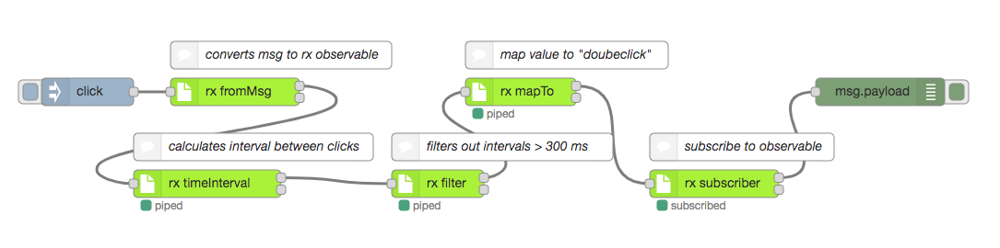

# node-red-contrib-rxjs


## Examples

### Filter doubleclicks

This flow implements a double click detection. if the click trigger is send twice in between 300 ms, a message will be send.



#### Flow
```
[{"id":"28a18fa8.c76aa","type":"debug","z":"222c111e.b5927e","name":"","active":true,"tosidebar":true,"console":false,"tostatus":false,"complete":"false","x":870,"y":220,"wires":[]},{"id":"e20d24cf.b5de18","type":"inject","z":"222c111e.b5927e","name":"","topic":"","payload":"click","payloadType":"str","repeat":"","crontab":"","once":false,"onceDelay":0.1,"x":150,"y":160,"wires":[["60223b76.331194"]]},{"id":"60223b76.331194","type":"rx fromMsg","z":"222c111e.b5927e","name":"","period":1000,"x":310,"y":160,"wires":[["cf7652a1.c0874"],[]]},{"id":"cf7652a1.c0874","type":"rx operator","z":"222c111e.b5927e","name":"","bufferCount_bufferSize":1,"bufferCount_startEvery":"","catch_func":"return { topic : \"error\", payload: error }","distinct_key":"payload","mapTo_topic":"foo","mapTo_payload":"bar","mapTo_payloadType":"str","take_count":1,"filter_func":"return msg.payload > 0","scan_seed":0,"scan_seedType":"num","scan_func":"return acc + msg.payload","skip_count":1,"repeat_count":1,"retry_number":1,"timeout":1000,"delay":1000,"operatorType":"timeInterval","x":300,"y":260,"wires":[["82d27e77.25bcf"],[]]},{"id":"82d27e77.25bcf","type":"rx operator","z":"222c111e.b5927e","name":"","bufferCount_bufferSize":1,"bufferCount_startEvery":"","catch_func":"return { topic : \"error\", payload: error }","distinct_key":"payload","mapTo_topic":"foo","mapTo_payload":"bar","mapTo_payloadType":"str","take_count":1,"filter_func":"return msg.interval < 300","scan_seed":0,"scan_seedType":"num","scan_func":"return acc + msg.payload","skip_count":1,"repeat_count":1,"retry_number":1,"timeout":1000,"delay":1000,"operatorType":"filter","x":490,"y":260,"wires":[["b05876ae.b26fa8"],[]]},{"id":"a922e527.a57108","type":"rx subscriber","z":"222c111e.b5927e","name":"","auto_subscribe":true,"bundle":false,"x":690,"y":220,"wires":[["28a18fa8.c76aa"],[]]},{"id":"b05876ae.b26fa8","type":"rx operator","z":"222c111e.b5927e","name":"","bufferCount_bufferSize":1,"bufferCount_startEvery":"","catch_func":"return { topic : \"error\", payload: error }","distinct_key":"payload","mapTo_topic":"","mapTo_payload":"double-click","mapTo_payloadType":"str","take_count":1,"filter_func":"return msg.payload > 0","scan_seed":0,"scan_seedType":"num","scan_func":"return acc + msg.payload","skip_count":1,"repeat_count":1,"retry_number":1,"timeout":1000,"delay":1000,"operatorType":"mapTo","x":540,"y":160,"wires":[["a922e527.a57108"],[]]}]
```


## Unit Tests

* install mocha globally with `npm install mocha -g`
* install dependencies with `npm install`
* run `npm test`